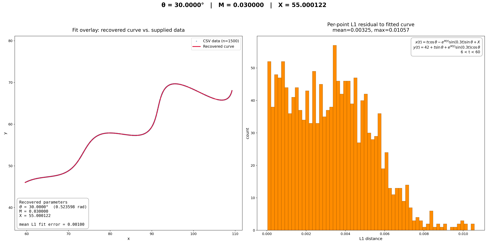
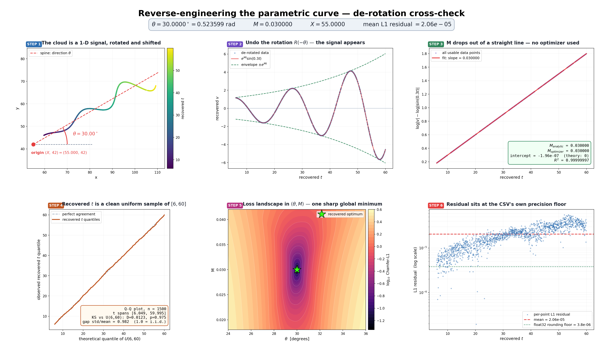

# FlamAI Parametric Curve Parameter Estimation

**Name:** Mohammed Aashik F

**Assignment:** FlamAI Software Development Engineer Interns (R&D / AI) Assignment

**Desmos Graph:** https://www.desmos.com/calculator/pvcngop138

This repo reverse-engineers the three unknown parameters $(\theta, M, X)$ of a parametric curve
from an unordered cloud of 1500 $(x, y)$ points. The parameters are first recovered with a bounded
global search against a Chamfer-L1 objective, then independently re-derived by algebraically
undoing the curve's rotation. Both routes land on the same answer: $\theta = 30^\circ$, $M = 0.03$,
$X = 55$.

---

## Final Answer

$$\boxed{\theta = 30^\circ,\qquad M = 0.03,\qquad X = 55}$$

Parameter domain: $6 < t < 60$. Derivation, cross-checks, and error analysis follow below
(Sections 1–10); the recovered-vs-refined breakdown is in Section 7.

---

## 1. The Problem

The given points $(x_i, y_i)$ lie on:

$$x(t) = t\cos\theta - e^{M|t|}\sin(0.3t)\sin\theta + X$$

$$y(t) = 42 + t\sin\theta + e^{M|t|}\sin(0.3t)\cos\theta$$

$\theta$, $M$, $X$ are unknown. $t$ is the curve parameter, $6 < t < 60$, and is not given —
the CSV has no $t$ column. Task: recover $\theta$, $M$, $X$.

| Symbol | Role | Range |
| --- | --- | --- |
| $\theta$ | rotation of the underlying signal about $(X, 42)$ | $0^\circ < \theta < 50^\circ$ |
| $M$ | exponential growth/decay of the oscillation amplitude | $-0.05 < M < 0.05$ |
| $X$ | horizontal translation | $0 < X < 100$ |
| $42$, $0.3$ | fixed — vertical offset and angular frequency | given |

$\theta$ is bounded in degrees but held in **radians** internally, since NumPy expects radians.

## 2. Input Data

[`xy_data.csv`](xy_data.csv): 1500 points, columns `x, y` only. $x \in [59.7, 109.2]$,
$y \in [46.0, 69.7]$.

The rows are **not** in $t$-order. If they were, consecutive rows would differ by
$\Delta t \approx 54/1500 \approx 0.036$, and the curve barely moves over that step — yet
adjacent rows jump by tens of units. So each point's $t$ is effectively unknown too, and a
row-index-as-$t$ fit is a non-starter. The fitting objective has to be correspondence-free.
(Section 6 shows the recovered $t$'s are statistically consistent with i.i.d. uniform sampling over
$[6,60]$, not any stored order.)

## 3. The Key Observation

Let $v(t) = e^{M|t|}\sin(0.3t)$. The two equations rearrange to:

$$x - X = t\cos\theta - v\sin\theta, \qquad y - 42 = t\sin\theta + v\cos\theta$$

which is just a rotation matrix acting on $(t, v)$:

$$\begin{bmatrix} x - X \\\\ y - 42 \end{bmatrix} = R(\theta)\begin{bmatrix} t \\\\ v \end{bmatrix}$$

So the curve is nothing but the 1-D signal $v(t)$, rigidly rotated by $\theta$ and shifted to
$(X, 42)$ — no shear, no scaling. Since $t > 0$ throughout, $v(t) = e^{Mt}\sin(0.3t)$.

This matters because rotations are invertible: apply $R(-\theta)$ to the data and every point
hands back its own $t$ and $v$. That's what makes an independent, optimizer-free cross-check
possible (Sections 5–6).

## 4. Approach

This is a nonlinear parameter-estimation problem, not a machine-learning one — the forward model
is known exactly, there's nothing to train.

**Stage 1 — global search** ([`fit_curve.py`](fit_curve.py)). Since each point's $t$ is unknown,
the loss minimizes over $t$ inside itself:

$$\mathcal{L}(\theta, M, X) = \frac{1}{N}\sum_i \min_{t} \big(|x_i - x(t)| + |y_i - y(t)|\big)$$

Approximated by sampling the candidate curve densely, building a `cKDTree`, and querying each
data point's nearest neighbour under `p=1` (L1) — matching the assignment's own scoring metric.
Optimized with `scipy.optimize.differential_evolution` (bounded, `popsize=25`, `maxiter=150`,
`seed=0`, 1500-point curve) since the objective is non-convex.

**Stage 2 — polish.** Nelder-Mead from the DE result, against a denser 8000-point curve, to shave
off the discretization error DE left behind.

**Stage 3 — cross-check and refine** ([`verify_and_visualize.py`](verify_and_visualize.py)).
De-rotate the cloud (Section 3) to get each point's own $t$, recover $M$ from a closed-form linear
regression (Section 5), then refine all three parameters by minimizing the pointwise residual
$|x(t_i) - x_i| + |y(t_i) - y_i|$ directly — sharper than Chamfer since there's no nearest-neighbour
approximation involved.

## 5. Recovering M Without an Optimizer

This does not independently recover $\theta$ and $X$ — the de-rotation in Section 3 still needs
Stage 1's $\theta, X$ estimates to compute $t$ and $v$ for each point. What's independent here is
$M$: once $t$ and $v$ are known, $M$ falls out of closed-form algebra rather than another search,
giving a check on Stage 1 that uses no optimizer of its own.

With $v = e^{Mt}\sin(0.3t)$, take logs of absolute values:

$$\log|v| - \log|\sin(0.3t)| = Mt$$

The left side is linear in $t$ with slope $M$ and zero intercept — a plain least-squares line, no
search required. Points near the zeros of $\sin(0.3t)$ are dropped (log blows up there), leaving
1355 of 1500 points.

| | Value |
| --- | --- |
| slope $M_{\text{analytic}}$ | 0.03000005 |
| intercept | $-1.96\times10^{-7}$ (theory: 0) |
| $R^2$ | 0.9999999716 |
| vs. optimizer's $M$ | agrees to $6.5\times10^{-8}$ |

Two mathematically distinct recovery routes — stochastic global search on a Chamfer distance, and
a closed-form regression on de-rotated coordinates — agree to 8 significant figures. That agreement
is hard to explain unless $\theta$, $M$, $X$ are correct rather than merely a good local optimum.

## 6. Sanity Checks

- **Recovered $t$ looks right.** De-rotating with the fitted $\theta, X$ gives $t \in [6.049,\
  59.995]$ — inside the stated domain — passing a KS test against $\mathcal{U}(6,60)$ ($D=0.0123$,
  $p=0.975$). A consistency check, not proof: it would fail if $\theta$ or $X$ were wrong, but
  passing is corroborating, not conclusive on its own.
- **Two starting points, one answer.** Stage 3's pointwise refinement, run from the raw optimizer
  output and from the candidate values $(30°, 0.03, 55)$, converges to the identical point
  ($\theta$=29.999973°, $M$=0.029999997, $X$=54.99999834) to $1.5\times10^{-12}$ — one well-defined
  optimum, not two competing local answers.
- **The pointwise check catches what Chamfer misses.** $X=55.000122$ (raw optimizer) scores a
  pointwise residual of $9.9\times10^{-5}$; $X=55$ scores $2.1\times10^{-5}$, 5x better —
  a gap the nearest-point Chamfer objective can't see.
- **Residuals are near the data's own noise floor.** The CSV is float32-precision (max deviation
  from the nearest float32 value is $3.8\times10^{-6}$, half a ULP at this magnitude). Residuals in
  the $10^{-5}$–$10^{-6}$ range are consistent with the numerical precision of the supplied float32
  data and are substantially smaller than the residuals produced by parameter perturbations
  (Section 7). This supports the interpretation that the remaining discrepancy is dominated by data
  precision rather than a systematic model mismatch.

## 7. Results

| Parameter | Optimizer (Stage 1+2) | Refined (Stage 3) | Final inferred value |
| --- | --- | --- | --- |
| $\theta$ | 29.999963° | 29.999973° | **30°** ($\pi/6$) |
| $M$ | 0.029999990 | 0.029999997 | **0.03** |
| $X$ | 55.000122 | 54.99999834 | **55** |

$$\theta = 30^\circ = \pi/6 \approx 0.523599 \text{ rad}, \qquad M = 0.03, \qquad X = 55$$

The refined estimates are numerically consistent with the simple values $(30°, 0.03, 55)$, which
reproduce the supplied point cloud to the observed precision. Two mathematically distinct recovery
routes converge on that same point, with residuals at the data's own precision floor — not a
mathematical proof that the generating parameters are exactly $30°/0.03/55$ (finite-precision data
can't distinguish $X=55$ from $X=55\pm10^{-6}$), but as close as this data can resolve.

### Metrics, and what each one actually measures

Three different L1 numbers show up in this repo — they're not the same thing:

| Metric | Measures | Value |
| --- | --- | --- |
| Chamfer-L1 (data → curve) | set-to-set distance, used to *find* the curve before $t$ is known | 0.00100 |
| Assignment metric (uniform-$t$ L1) | paired distance between the fitted curve and the reference curve, sampled at matching $t$ | $1.51\times10^{-4}$ |
| Pointwise de-rotation residual | paired distance using each point's own recovered $t$ | $2.1\times10^{-5}$ (reference values) → $3.5\times10^{-6}$ (Stage 3 refined) |

The assignment metric — the one used for grading — is computed by sampling both curves at the same
uniformly spaced $t$ values over $[6,60]$ and taking the mean coordinate-wise L1 distance between
the corresponding points. By that metric, the fitted and reference curves are $1.5\times10^{-4}$
apart. For context, perturbing a single parameter ($\theta+0.1°$, $M+0.001$, or $X+0.1$) moves that
same metric to 0.08–0.11 — two to three orders of magnitude larger — so the fit isn't sitting in a
flat, weakly-constrained direction.

## 8. Figures

### `fit_result.png` — Stage 1+2 fit



Left: the 1500 CSV points against the recovered curve — no visible gap anywhere. Right: the
per-point residual distribution, showing the fit and residual spread across the sampled points,
with no outliers or region of concentrated error.

### `verification.png` — independent cross-check



1. The raw cloud, coloured by recovered $t$, with the recovered rotation axis drawn from $(X,42)$.
2. After undoing the rotation, the data collapses onto $e^{Mt}\sin(0.3t)$ to within the numerical
   precision of the supplied data.
3. The linear fit that recovers $M$ — slope 0.030000, $R^2 = 0.9999999716$.
4. Q–Q plot: recovered $t$ against $\mathcal{U}(6,60)$, sitting on the identity line.
5. The $(\theta, M)$ loss landscape — shows the observed minimum in the plotted region, with no
   competing basin visible at this scale (a local slice, not a global-optimality guarantee).
6. Per-point residual on a log scale against the float32 noise floor.

## 9. Final Equation

$$x(t) = t\cos\left(\tfrac{\pi}{6}\right) - e^{0.03t}\sin(0.3t)\sin\left(\tfrac{\pi}{6}\right) + 55$$

$$y(t) = 42 + t\sin\left(\tfrac{\pi}{6}\right) + e^{0.03t}\sin(0.3t)\cos\left(\tfrac{\pi}{6}\right)$$

$$6 < t < 60$$

**Submission expression** (raw LaTeX — paste directly into a Desmos calculator as a single
expression, then set the domain to $6 \le t \le 60$):

```
\left(t*\cos(0.523599)-e^{0.03\left|t\right|}\cdot\sin(0.3t)\sin(0.523599)+55,42+t*\sin(0.523599)+e^{0.03\left|t\right|}\cdot\sin(0.3t)\cos(0.523599)\right)
```

Plain-text form, for readability:

```
(t*cos(0.523599) - e^(0.03|t|)*sin(0.3t)*sin(0.523599) + 55,
 42 + t*sin(0.523599) + e^(0.03|t|)*sin(0.3t)*cos(0.523599))
```

## 10. Running It

```bash
pip install -r requirements.txt
python3 fit_curve.py              # Stage 1+2 -> fit_result.json, fit_result.png
python3 verify_and_visualize.py   # cross-check + Stage 3 -> verification.png
```

Run in that order — the second script reads `fit_result.json` and imports from `fit_curve.py`.
Both scripts are deterministic (`seed=0`); `fit_curve.py` takes ~9s, `verify_and_visualize.py`
~7s.

## Files

```
fit_curve.py                Stage 1+2: Differential Evolution + Nelder-Mead on Chamfer-L1
verify_and_visualize.py     de-rotation cross-check, analytic M, Stage 3 refinement, figure
xy_data.csv                 supplied point cloud (1500 points)
fit_result.json             recovered parameters, stage scores, Desmos expression
fit_result.png / verification.png    figures described above
requirements.txt            numpy, pandas, scipy, matplotlib
```

Built with NumPy (vectorized model + rotation algebra), SciPy (`differential_evolution`,
Nelder-Mead, `cKDTree` for L1 nearest-neighbour, `linregress`, `kstest`), pandas (CSV loading),
and Matplotlib (both figures). No ML framework — the model is known in closed form, there are
only three unknowns.

## References

Citation Style:APA


**Algorithms and methods**

- Storn, R., & Price, K. (1997). Differential evolution – A simple and efficient heuristic for global optimization over continuous spaces. *Journal of Global Optimization, 11*(4), 341–359. https://doi.org/10.1023/A:1008202821328 — algorithm behind Stage 1 (`scipy.optimize.differential_evolution`).
- Nelder, J. A., & Mead, R. (1965). A simplex method for function minimization. *The Computer Journal, 7*(4), 308–313. https://doi.org/10.1093/comjnl/7.4.308 — local refinement algorithm used in Stage 2 and Stage 3 (`scipy.optimize.minimize(method="Nelder-Mead")`).
- Barrow, H. G., Tenenbaum, J. M., Bolles, R. C., & Wolf, H. C. (1977). Parametric correspondence and chamfer matching: Two new techniques for image matching. *Proceedings of the 5th International Joint Conference on Artificial Intelligence*, 659–663. — origin of the Chamfer-distance formulation used as the Stage 1 objective (nearest-point set-to-set matching).
- Bentley, J. L. (1975). Multidimensional binary search trees used for associative searching. *Communications of the ACM, 18*(9), 509–517. https://doi.org/10.1145/361002.361007 — the k-d tree data structure used for nearest-neighbour queries (`scipy.spatial.cKDTree`).
- Massey, F. J. (1951). The Kolmogorov-Smirnov test for goodness of fit. *Journal of the American Statistical Association, 46*(253), 68–78. https://doi.org/10.1080/01621459.1951.10500769 — statistical test used in Section 6 to check the recovered $t$ values against $\mathcal{U}(6,60)$.

**Software**

- Harris, C. R., Millman, K. J., van der Walt, S. J., et al. (2020). Array programming with NumPy. *Nature, 585*, 357–362. https://doi.org/10.1038/s41586-020-2649-2
- Virtanen, P., Gommers, R., Oliphant, T. E., et al. (2020). SciPy 1.0: Fundamental algorithms for scientific computing in Python. *Nature Methods, 17*, 261–272. https://doi.org/10.1038/s41592-019-0686-2
- The pandas development team. (2024). *pandas-dev/pandas: Pandas* [Computer software]. Zenodo. https://doi.org/10.5281/zenodo.3509134
- Hunter, J. D. (2007). Matplotlib: A 2D graphics environment. *Computing in Science & Engineering, 9*(3), 90–95. https://doi.org/10.1109/MCSE.2007.55
